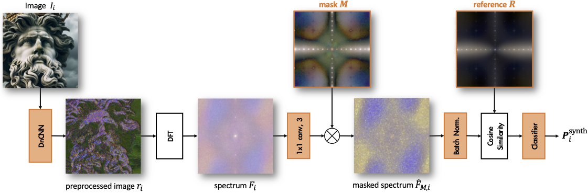

# MaskSim: Detection of synthetic images by masked spectrum similarity analysis
This is the official code of the paper: "MaskSim: Detection of synthetic images by masked spectrum similarity analysis" Yanhao Li, Quentin Bammey, Marina Gardella, Tina Nikoukhah, Jean-Michel Morel, Miguel Colom, Rafael Grompone von Gioi.




## Overview
This paper describes a semi-white-box method for detecting synthetic images by revealing anomalous patterns in the spectral domain. Specifically, we train a mask to enhance the most discriminative frequencies and simultaneously train a reference pattern that resembles the patterns produced by a given generative method. The proposed method produces comparable results to the state-of-the-art methods and highlights cues that can be used as forensic evidence. In contrast to most methods in the literature, the detections of the proposed method are explainable to a high degree.


## Requirements
See `requirements.txt`

## Data preparation


The pristine image datasets include `Mit-5k`, `Dresden`, `COCO`, `HDR-Burst` and `Raise-1k`. The synthetic image datasets include `PolarDiffShield` and `Synthbuster`. Detailed data scheme for training, validation and test is shown below:

dataset         | training | validation | test
:-------------: | :------: | :--------: | :--:
[Mit-5k](https://data.csail.mit.edu/graphics/fivek/)          | ✅       |            |  
[Dreden](https://dl.acm.org/doi/10.1145/1774088.1774427)          | ✅       |            |  
[COCO](https://cocodataset.org/#home)            | ✅       | ✅         | 
[HDR-Burst](https://hdrplusdata.org/dataset.html)       |          |         ✅ | 
[Raise-1k](http://loki.disi.unitn.it/RAISE/download.html)        |          |            | ✅
[PolarDiffShield](https://github.com/qbammey/polardiffshield) | ✅       | ✅           | 
[Synthbuster](https://zenodo.org/records/10066460)     |          |             | ✅


Use the following commands to prepare the data:

``` bash
sh data_preparation.sh
```

The structure of the `processed_data/` folder should be like:

```
processed_data/
├──JPEG_Qrandom
│   ├──raise
│   └──synthbuster
│       ├──dalle2
│       ├──dalle3
│       ├──...
└──train
    ├──coco_train
    ├──coco_val
    ├──dresden
    ├──hdrburst
    ├──mit5k
    └──newsynth
        ├──dalle2
        ├──dalle3
        ├──...
```


## Evaluation

The pretrained model weights can be downloaded [here](http://avocat.ovh.hw.ipol.im/static/yanhao/masksim/checkpoints.zip). Then unzip the weight files in the `checkpoints` folder like below:
```
checkpoints/JPEG_Qrandom_w512/newsynth
├──dalle2-epoch=37-valid_auroc=1.00-valid_loss=0.065-low_loss.ckpt
├──dalle3-epoch=47-valid_auroc=1.00-valid_loss=0.036-low_loss.ckpt
├──...
```


``` sh
python evaluate.py -Q random -w 512 --compression jpeg --img_q random
```


## Test on a single image
To test the program on one single image:
``` sh
python detect_one_image.py -i <img_path>
```


## Training


``` sh
python train.py -w 512 -b 8 -e 50 -p DnCNN -Q random --compression jpeg --progress
```


## Bibtex
```
@InProceedings{li2024masksim,
    author    = {Li, Yanhao and Bammey, Quentin and Gardella, Marina and Nikoukhah, Tina and Morel, Jean-Michel and Colom, Miguel and Von Gioi, Rafael Grompone},
    title     = {MaskSim: Detection of Synthetic Images by Masked Spectrum Similarity Analysis},
    booktitle = {Proceedings of the IEEE/CVF Conference on Computer Vision and Pattern Recognition (CVPR) Workshops},
    month     = {June},
    year      = {2024},
    pages     = {3855--3865}
}
```


Feel free to leave your comments at the [Issues](https://github.com/li-yanhao/masksim/issues) for any bugs found or any discussion 😇
